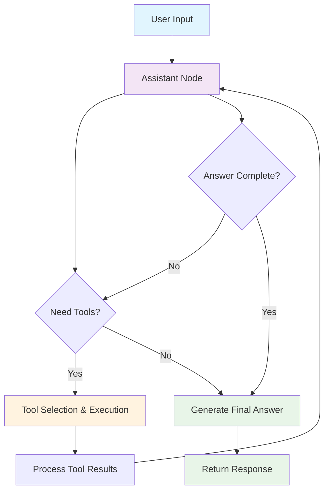

# 🤖 Multi-Model AI Agent Suite

> A powerful collection of AI-powered applications built on a sophisticated multi-modal agent capable of handling text, images, audio, documents, and complex reasoning tasks.

[](https://python.org)
[](https://streamlit.io)
[](https://openai.com)
[](https://langchain.com)

## 🎯 Overview

This project demonstrates a comprehensive AI agent system built with **LangChain**, **OpenAI GPT-4o**, and **LangGraph** that can handle diverse tasks across multiple modalities. The agent serves as the foundation for specialized applications, each targeting different use cases and user needs.

## 🚀 Live Applications

### 📚 Smart Document Assistant
**Purpose:** Upload and analyze any type of document with AI-powered insights
- **File Support:** PDF, Word, PowerPoint, Excel, CSV, JSON, TXT, Images, Audio
- **Capabilities:** Document summarization, Q&A, data extraction, OCR, audio transcription
- **Use Cases:** Business document analysis, research, content extraction


### 🧮 AI Math Tutor
**Purpose:** Educational assistant for mathematics and science problem-solving
- **Math Topics:** Algebra, Calculus, Geometry, Statistics, Trigonometry
- **Features:** Step-by-step solutions, unit conversions, formula explanations
- **Target Users:** Students, educators, professionals needing quick calculations


### 🎵 Audio Transcription Service
**Purpose:** High-quality audio transcription and content analysis
- **Audio Support:** MP3, WAV, M4A, and other formats
- **Features:** Whisper-powered transcription, content summarization, key topic extraction
- **Applications:** Meeting notes, interview transcriptions, podcast analysis


### 📊 Data Analysis Assistant
**Purpose:** Intelligent data processing and insight generation
- **Data Formats:** Excel, CSV, JSON, structured data
- **Analytics:** Statistical analysis, trend identification, automated reporting
- **Benefits:** Quick data insights, pattern recognition, visualization suggestions


## 🛠️ Core Agent Capabilities

The underlying AI agent is built with advanced capabilities that power all applications:

| Feature | Technology | Description |
|---------|------------|-------------|
| **🔍 OCR & Vision** | GPT-4o Vision | Extract text from images and scanned documents |
| **🎧 Audio Processing** | OpenAI Whisper | High-quality audio transcription and analysis |
| **📄 Document Processing** | Multiple Libraries | Handle PDF, Office docs, spreadsheets, notebooks |
| **🧮 Mathematical Computing** | SymPy | Symbolic mathematics and equation solving |
| **📐 Unit Conversion** | Pint | Physics and engineering unit conversions |
| **🌐 Web Search** | SerpAPI | Real-time information retrieval |
| **📖 Knowledge Base** | Wikipedia API | Access to encyclopedic knowledge |
| **💻 Code Execution** | Riza API | Safe Python code execution environment |
| **🧠 Conversational AI** | GPT-4o + LangGraph | Intelligent conversation flow and reasoning |

## 📁 Project Structure

```
AI_Agents/
└── 🤖 AI_Assistant/                 # Main Project Directory
    ├── agent.py                     # Main multi-modal AI agent
    ├── secret_key.py               # API key configuration
    ├── token_utils.py              # Token management utilities
    ├── requirements.txt            # Python dependencies
    ├── Dockerfile                  # Docker configuration
    ├── docker-compose.yml          # Docker compose setup
    ├── readme.md                   # This documentation
    ├── Images/                     # 📸 Application screenshots
    │   ├── Smart Document Analysis.png
    │   ├── AI Math Tutor.png
    │   ├── Audio Transcription.png
    │   └── Data Analysis.png
    ├── test/                       # 🧪 Testing Suite
    │   ├── test_agent.py           # Agent functionality tests
    │   ├── test_audio.py           # Audio processing tests
    │   └── test_multiple_streamlit.py # Multi-app testing
    └── applications/               # 🖥️ Streamlit Applications
        ├── smart_document_assistant.py # 📚 Document analysis app
        ├── ai_math_tutor.py       # 🧮 Educational math assistant
        ├── audio_transcription_service.py # 🎵 Audio processing app
        └── data_analysis_assistant.py  # 📊 Data analytics app
```

## 🔧 Installation & Setup

### Prerequisites
- Python 3.12+
- OpenAI API key
- SerpAPI key (optional, for web search)

### Quick Start

1. **Clone the repository:**
   ```bash
   git clone https://github.com/AbdulRehman0004/AI-Agents.git
   cd AI-Agents/AI_Assistant
   ```

2. **Create virtual environment:**
   ```bash
   python -m venv venv
   source venv/bin/activate  # On Windows: venv\Scripts\activate
   ```

3. **Install dependencies:**
   ```bash
   pip install -r requirements.txt
   ```

4. **Configure API keys:**
   ```python
   # Create secret_key.py
   openai_key = "your-openai-api-key-here"
   serpapi_key = "your-serpapi-key-here"  # Optional
   ```

5. **Launch the AI Assistant Suite:**
   ```bash
   # Navigate to applications folder
   cd applications
   
   # Run individual applications directly
   streamlit run smart_document_assistant.py
   streamlit run ai_math_tutor.py
   streamlit run audio_transcription_service.py
   streamlit run data_analysis_assistant.py
   ```

## 🎮 Usage Examples

### Document Analysis
```python
# Upload a PDF research paper
# Ask: "What are the main findings of this study?"
# Get: Comprehensive summary with key insights
```

### Math Problem Solving
```python
# Input: "Solve x² + 5x + 6 = 0"
# Output: Step-by-step solution with explanation
# Result: x = -2, x = -3 (with detailed work shown)
```

### Audio Transcription
```python
# Upload meeting recording
# Get: Full transcription + key topics + action items
```

### Data Analysis
```python
# Upload sales data CSV
# Ask: "What trends do you see in this quarter's sales?"
# Get: Statistical analysis + insights + recommendations
```

## 🏗️ Architecture

### Agent Design Pattern


### ReAct (Reasoning & Acting) Flow
The agent follows an iterative ReAct pattern:
1. **Reasoning**: Analyzes the user's request and current context
2. **Acting**: Selects and executes appropriate tools if needed
3. **Observing**: Processes tool results and integrates new information
4. **Deciding**: Determines if more tools are needed or if answer is complete
5. **Repeating**: Continues the cycle until a satisfactory answer is reached

### Key Components
- **LangGraph StateGraph:** Manages iterative conversation flow and maintains state
- **Assistant Node:** Core reasoning engine powered by GPT-4o
- **Tool Node:** Executes selected tools and returns results
- **Conditional Edges:** Determines when to use tools vs. provide final answer
- **ReAct Pattern:** Continuous reasoning-acting cycle until optimal solution is found
- **State Management:** Preserves context, file references, and conversation history

## 🎯 Technical Highlights

### Multi-Modal Processing
- **Text:** Natural language understanding and generation
- **Images:** OCR, visual analysis, diagram interpretation
- **Audio:** Speech-to-text with content analysis
- **Documents:** Structured data extraction from various formats

### Advanced Reasoning
- **Iterative Problem Solving:** Agent continues working until it finds the best answer
- **Multi-Tool Orchestration:** Can use multiple tools in sequence or combination
- **Context Preservation:** Maintains conversation history and file state across iterations
- **Self-Evaluation:** Determines when an answer is complete and satisfactory
- **Error Recovery:** Handles tool failures and tries alternative approaches
- **Smart Chunking:** Automatically manages large files and token limits

### Scalable Architecture
- **Modular Design:** Easy to extend with new tools and capabilities
- **Error Handling:** Robust error recovery and user feedback
- **Performance Optimization:** Efficient processing and caching

## 🚀 Deployment Options

### Local Development
```bash
# Start individual applications (from AI_Assistant directory)
cd applications

# Run individual applications
streamlit run smart_document_assistant.py
streamlit run ai_math_tutor.py
streamlit run audio_transcription_service.py
streamlit run data_analysis_assistant.py
```

### Cloud Deployment
- **Streamlit Cloud:** One-click deployment from GitHub
- **Heroku:** Container-based deployment
- **AWS/GCP:** Scalable cloud infrastructure

### Docker Support
```dockerfile
FROM python:3.12-slim
WORKDIR /app
COPY requirements.txt .
RUN pip install -r requirements.txt
COPY . .
EXPOSE 8501
WORKDIR /app/applications
CMD ["streamlit", "run", "smart_document_assistant.py"]
```

### Multi-App Deployment
```bash
# For production, you might want to run each app separately
docker-compose up  # Uses the included docker-compose.yml
```

## 🔮 Future Enhancements

### Planned Features
- [ ] **User Authentication:** Personal profiles and history
- [ ] **Database Integration:** PostgreSQL for data persistence
- [ ] **API Endpoints:** RESTful API for programmatic access
- [ ] **Mobile App:** React Native companion application
- [ ] **Collaborative Features:** Team workspaces and sharing
- [ ] **Advanced Analytics:** Usage metrics and performance insights

### Potential Applications
- **Enterprise Solutions:** Custom document processing workflows
- **Educational Platform:** Comprehensive learning management system
- **Research Tools:** Academic paper analysis and literature reviews
- **Business Intelligence:** Advanced data analytics and reporting

## 📊 Performance & Capabilities

| Metric | Performance |
|--------|-------------|
| **Document Processing** | PDF, DOCX, PPTX, XLSX, CSV, JSON, TXT |
| **Audio Transcription** | 95%+ accuracy with Whisper |
| **Math Problem Solving** | Algebra through Advanced Calculus |
| **Image Analysis** | OCR + Visual Understanding |
| **Response Time** | < 5 seconds for most queries |
| **File Size Limits** | Up to 100MB per file |

## 🔧 Troubleshooting

### General Issues

**Problem:** Import errors or missing dependencies
- **Solution:** Ensure virtual environment is activated and run `pip install -r requirements.txt`

**Problem:** API key errors
- **Solution:** Check that `secret_key.py` contains valid OpenAI API key

**Problem:** File upload issues
- **Solution:** Ensure files are under 100MB and in supported formats

### Performance Tips
- **Multiple Apps:** You can run multiple applications simultaneously
- **Memory Usage:** Close unused browser tabs to free up memory
- **Startup Time:** First launch may take longer due to model loading

## 🤝 Contributing

Contributions are welcome! Please feel free to submit a Pull Request. For major changes, please open an issue first to discuss what you would like to change.

### Development Setup
1. Fork the repository
2. Create a feature branch (`git checkout -b feature/AmazingFeature`)
3. Commit your changes (`git commit -m 'Add some AmazingFeature'`)
4. Push to the branch (`git push origin feature/AmazingFeature`)
5. Open a Pull Request

## 📄 License

This project is licensed under the MIT License - see the [LICENSE](LICENSE) file for details.

## 🙏 Acknowledgments

- **OpenAI** for GPT-4o and Whisper models
- **LangChain** for the agent framework
- **Streamlit** for the web application framework
- **Open Source Community** for the various libraries and tools
+
---

⭐ **Star this repository if you found it helpful!** ⭐

*Built with ❤️ and AI*
