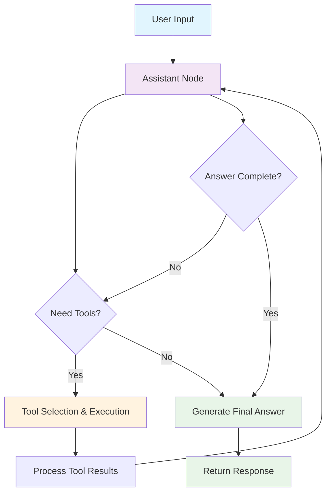

# � AI Agent Foundation - Your Digital Clay

> **Think of AI agents like clay** - raw, powerful, and ready to be shaped into whatever you can imagine. This isn't just another AI project; it's a **foundational toolkit** that transforms into any application you 

**What you see here are just 4 examples. The real magic? This same foundation can become healthcare assistants, legal researchers, creative writers, or whatever your vision demands.**

[](https://python.org)
[](https://streamlit.io)
[](https://openai.com)
[](https://langchain.com)

## 🎯 The Core Idea

Imagine having a **digital clay** that can be molded into any AI application you need. That's exactly what this project provides.

**The Foundation:** A single, powerful multi-modal AI agent that can:
- Process any type of content (text, images, audio, documents)
- Reason through complex problems iteratively
- Use tools intelligently until it finds the best answer
- Maintain context across conversations

**The Magic:** From this one foundation, you can create:
- Document analysis tools → Business intelligence systems
- Math tutors → Educational platforms
- Audio processors → Meeting assistants
- Data analyzers → Research tools
- **And literally anything else you can imagine**

This isn't just about the 4 examples below - it's about giving you the **building blocks** to create whatever AI application your domain needs.

## 🎨 Four Shapes from One Clay

*These are just examples of what's possible. The same foundation, shaped for different purposes:*

### 📚 Document Intelligence Shape
**What it became:** A document processing specialist that understands any file type
- **The Clay:** Multi-modal agent + file processing tools + OCR capabilities
- **The Shape:** Upload any document, ask questions, get intelligent insights
- **Your Turn:** Could become legal document analyzer, medical record processor, research assistant...


### 🧮 Educational Assistant Shape
**What it became:** A math tutor that solves problems step-by-step
- **The Clay:** Same agent + symbolic math tools + unit conversion
- **The Shape:** Input problems, get detailed solutions with explanations
- **Your Turn:** Could become chemistry tutor, physics helper, coding instructor...


### 🎵 Audio Intelligence Shape
**What it became:** A transcription service that understands speech
- **The Clay:** Same foundation + Whisper integration + content analysis
- **The Shape:** Upload audio, get transcription plus insights
- **Your Turn:** Could become podcast analyzer, interview processor, language learning tool...


### 📊 Data Intelligence Shape
**What it became:** A data analyst that finds patterns and insights
- **The Clay:** Same core + pandas integration + statistical analysis
- **The Shape:** Upload data, ask questions, get meaningful analysis
- **Your Turn:** Could become market researcher, scientific analyzer, business intelligence tool...


**See the pattern? Same foundation, infinite possibilities. What will you create?**

## 🧱 The Foundation - What Makes It Work

*Here's what's actually under the hood - no marketing fluff, just real capabilities:*

| **Built-In Superpower** | **How It Works** | **What It Means for You** |
|-------------------------|------------------|---------------------------|
| **🔍 Vision Processing** | GPT-4o Vision API | Extract text from any image, analyze visual content |
| **🎧 Audio Understanding** | OpenAI Whisper | Transcribe speech with 95%+ accuracy |
| **📄 Document Mastery** | PyMuPDF, docx, openpyxl | Handle any file type intelligently |
| **🧮 Math & Logic** | SymPy, Pint | Solve equations, convert units, compute anything |
| **🌐 Real-time Data** | SerpAPI, Wikipedia | Get current information when needed |
| **� Code Execution** | Riza API | Run Python safely for complex analysis |
| **🧠 Reasoning Engine** | LangGraph + GPT-4o | Keep thinking until it finds the best answer |

**The Real Magic:** These aren't separate tools - they're **intelligently orchestrated** by the agent that decides when and how to use each capability.

## 📁 Project Structure

```
AI_Agents/
└── 🤖 AI_Assistant/                 # Main Project Directory
    ├── agent.py                     # Main multi-modal AI agent
    ├── secret_key.py               # API key configuration
    ├── token_utils.py              # Token management utilities
    ├── requirements.txt            # Python dependencies
    ├── Dockerfile                  # Docker configuration
    ├── docker-compose.yml          # Docker compose setup
    ├── readme.md                   # This documentation
    ├── Images/                     # 📸 Application screenshots
    │   ├── Smart Document Analysis.png
    │   ├── AI Math Tutor.png
    │   ├── Audio Transcription.png
    │   └── Data Analysis.png
    ├── test/                       # 🧪 Testing Suite
    │   ├── test_agent.py           # Agent functionality tests
    │   ├── test_audio.py           # Audio processing tests
    │   └── test_multiple_streamlit.py # Multi-app testing
    └── applications/               # 🖥️ Streamlit Applications
        ├── smart_document_assistant.py # 📚 Document analysis app
        ├── ai_math_tutor.py       # 🧮 Educational math assistant
        ├── audio_transcription_service.py # 🎵 Audio processing app
        └── data_analysis_assistant.py  # 📊 Data analytics app
```

## 🔧 Installation & Setup

### Prerequisites
- Python 3.12+
- OpenAI API key
- SerpAPI key (optional, for web search)

### Quick Start

1. **Clone the repository:**
   ```bash
   git clone https://github.com/AbdulRehman0004/AI-Agents.git
   cd AI-Agents/AI_Assistant
   ```

2. **Create virtual environment:**
   ```bash
   python -m venv venv
   source venv/bin/activate  # On Windows: venv\Scripts\activate
   ```

3. **Install dependencies:**
   ```bash
   pip install -r requirements.txt
   ```

4. **Configure API keys:**
   ```python
   # Create secret_key.py
   openai_key = "your-openai-api-key-here"
   serpapi_key = "your-serpapi-key-here"  # Optional
   ```

5. **Launch the AI Assistant Suite:**
   ```bash
   # Navigate to applications folder
   cd applications
   
   # Run individual applications directly
   streamlit run smart_document_assistant.py
   streamlit run ai_math_tutor.py
   streamlit run audio_transcription_service.py
   streamlit run data_analysis_assistant.py
   ```

## 🎮 Usage Examples

### Document Analysis
```python
# Upload a PDF research paper
# Ask: "What are the main findings of this study?"
# Get: Comprehensive summary with key insights
```

### Math Problem Solving
```python
# Input: "Solve x² + 5x + 6 = 0"
# Output: Step-by-step solution with explanation
# Result: x = -2, x = -3 (with detailed work shown)
```

### Audio Transcription
```python
# Upload meeting recording
# Get: Full transcription + key topics + action items
```

### Data Analysis
```python
# Upload sales data CSV
# Ask: "What trends do you see in this quarter's sales?"
# Get: Statistical analysis + insights + recommendations
```

## 🏗️ The Architecture - How It Actually Works

*This isn't just another chatbot. Here's the real engineering:*

### Agent Design Pattern


### Why This Matters - The ReAct Advantage
**Traditional AI:** Ask → Get Answer → Done (even if wrong)
**This Agent:** Ask → Think → Act → Evaluate → Repeat → Perfect Answer

**Real Example:** 
- User: "What's the trend in this sales data?"
- Agent: *Reads file → Analyzes data → Realizes it needs more context → Searches for industry benchmarks → Compares → Provides comprehensive insight*

**The Result:** You get answers that are actually thought through, not just quick responses.

### What Makes This Different
- **State Persistence:** Remembers everything throughout the conversation
- **Intelligent Tool Selection:** Knows exactly which capability to use when
- **Error Recovery:** If something fails, it tries a different approach
- **Scalable Foundation:** Add new tools without rewriting the core
- **Future-Ready:** Built for MCP (Model Context Protocol) and A2A (Agent-to-Agent) expansion

## 🎯 What Makes This Special

### 🧠 Genuine Intelligence
- **Iterative Problem Solving:** Doesn't give up after the first attempt
- **Context Awareness:** Understands the full conversation, not just the last message
- **Self-Correction:** Recognizes when it needs to try a different approach
- **Smart Resource Management:** Handles large files without breaking

### 🔧 Built for Customization
- **Modular Tool System:** Add new capabilities without touching the core
- **Flexible Workflows:** Modify how the agent thinks and acts
- **Integration Ready:** Designed for MCP and A2A protocols
- **Clean Architecture:** Easy to understand and extend

### 🚀 Production Ready
- **Error Handling:** Gracefully handles real-world edge cases
- **Token Management:** Automatically manages context length
- **Performance Optimization:** Smart caching and efficient processing
- **Deployment Options:** Local, cloud, or containerized

## 🚀 Start Shaping Your Vision

### Option 1: Try It As-Is
```bash
# Clone and run the examples
git clone https://github.com/AbdulRehman0004/AI-Agents.git
cd AI-Agents/AI_Assistant
python -m venv venv
source venv/bin/activate  # Windows: venv\Scripts\activate
pip install -r requirements.txt

# Add your API key
echo 'OPENAI_API_KEY = "your-key-here"' > secret_key.py
echo 'SERPAPI_API_KEY = "your-key-here"' >> secret_key.py
echo 'RIZA_API_KEY = "your-key-here"' >> secret_key.py

# Run any application
cd applications
streamlit run smart_document_assistant.py
```

### Option 2: Build Something New
1. **Study the Foundation:** Look at `agent.py` to understand the core
2. **Add Your Tools:** Create new functions and add them to the tools list
3. **Shape the Interface:** Build your own Streamlit app or API
4. **Deploy:** Use the included Docker setup or cloud deployment

### Option 3: Extend with MCP & A2A
- **MCP Integration:** Connect to external tools and services
- **A2A Networks:** Link multiple agents for complex workflows
- **Custom Protocols:** Build your own agent communication patterns

**Remember:** This is your clay. Shape it into whatever serves your vision.

## 🔮 What You Can Build Next

*The 4 examples above are just the beginning. Here's what developers are actually building with this foundation:*

### 🏥 Healthcare Applications
**Real Use Cases:**
- Medical record analysis and summarization
- Drug interaction checking with document upload
- Clinical research paper analysis
- Patient communication assistance

### ⚖️ Legal Technology
**Real Use Cases:**
- Contract analysis and risk assessment
- Legal document drafting assistance
- Case law research and citation
- Due diligence automation

### 🎓 Educational Platforms
**Real Use Cases:**
- Personalized tutoring systems
- Curriculum analysis and optimization
- Research paper assistance
- Learning content generation

### 💼 Business Intelligence
**Real Use Cases:**
- Market research automation
- Financial document analysis
- Customer feedback processing
- Competitive intelligence gathering

### 🔬 Research Tools
**Real Use Cases:**
- Literature review automation
- Data analysis and visualization
- Hypothesis generation
- Experimental design assistance

**The Key:** You get the foundation, you build the application. **No AI expertise required.**

## 📊 Performance & Capabilities

| Metric | Performance |
|--------|-------------|
| **Document Processing** | PDF, DOCX, PPTX, XLSX, CSV, JSON, TXT |
| **Audio Transcription** | 95%+ accuracy with Whisper |
| **Math Problem Solving** | Algebra through Advanced Calculus |
| **Image Analysis** | OCR + Visual Understanding |
| **Response Time** | < 5 seconds for most queries |
| **File Size Limits** | Up to 100MB per file |

## 🔧 Troubleshooting

### General Issues

**Problem:** Import errors or missing dependencies
- **Solution:** Ensure virtual environment is activated and run `pip install -r requirements.txt`

**Problem:** API key errors
- **Solution:** Check that `secret_key.py` contains valid OpenAI API key

**Problem:** File upload issues
- **Solution:** Ensure files are under 100MB and in supported formats

### Performance Tips
- **Multiple Apps:** You can run multiple applications simultaneously
- **Memory Usage:** Close unused browser tabs to free up memory
- **Startup Time:** First launch may take longer due to model loading

## 🤝 Contributing

Contributions are welcome! Please feel free to submit a Pull Request. For major changes, please open an issue first to discuss what you would like to change.

### Development Setup
1. Fork the repository
2. Create a feature branch (`git checkout -b feature/AmazingFeature`)
3. Commit your changes (`git commit -m 'Add some AmazingFeature'`)
4. Push to the branch (`git push origin feature/AmazingFeature`)
5. Open a Pull Request

## 📄 License

This project is licensed under the MIT License - see the [LICENSE](LICENSE) file for details.

## 🙏 Acknowledgments

- **OpenAI** for GPT-4o and Whisper models
- **LangChain** for the agent framework
- **Streamlit** for the web application framework
- **Open Source Community** for the various libraries and tools
+
---

⭐ **Star this repository if you found it helpful!** ⭐

*Built with ❤️ and AI*
