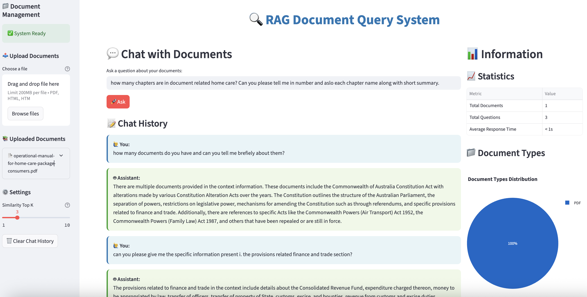
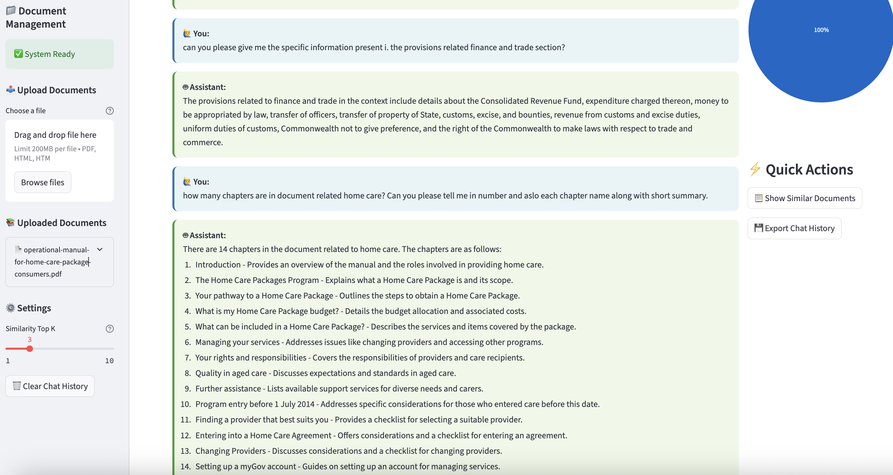

# RAG System: Chat With Your Documents

A Retrieval-Augmented Generation (RAG) system that lets you upload documents, builds a smart database, and gives you an interactive chatbot to answer questions about your files. Built with LlamaIndex, ChromaDB, and Streamlit, this project is a foundation for document-based AI assistants.

---

## Dashboard Preview

Below are example screenshots of the Streamlit dashboard in action:


*Main dashboard: document upload, chat interface, analytics.*


*Chat history and Q&A with your documents.*

---

## How It Works

1. **Upload Documents**: Add PDF or HTML files (examples are included in the `documents` folder).
2. **Automatic Processing**: The system extracts text and stores it in a vector database (ChromaDB) using advanced embeddings (OpenAI via LlamaIndex).
3. **Ask Questions**: Use the Streamlit web dashboard to chat with your documents. The chatbot finds and summarizes answers from your files.
4. **See Results**: The dashboard shows answers, chat history, and analytics about your documents.

---

## Features

- **Document Processing**: Extract text from PDF and HTML files
- **Vector Database**: Store and retrieve documents using ChromaDB
- **Query Engine**: Ask questions and get answers from your documents
- **Interactive Chatbot**: Chat with your documents in real-time via Streamlit
- **Batch Processing**: Process multiple queries at once
- **Document Management**: Upload, store, and manage documents
- **Chat History**: Keep track of questions and answers
- **Visual Analytics**: Charts and statistics about your documents

---

## Technical Stack

- **LlamaIndex**: For document indexing, embeddings, and retrieval
- **ChromaDB**: Vector database for fast semantic search
- **OpenAI API**: For generating embeddings and answering questions
- **Streamlit**: Interactive web dashboard and chatbot interface
- **PyMuPDF & BeautifulSoup**: Extract text from PDF and HTML
- **Plotly & Pandas**: Visual analytics and data handling
- **python-dotenv**: Manage environment variables

---

## File Structure

```
agent/
├── config.py              # Configuration and API keys
├── document_processor.py  # Document text extraction
├── database.py            # Database operations
├── query_engine.py        # Query processing
├── main.py                # Main application
├── streamlit_app.py       # Streamlit web interface
├── launch.py              # Python launcher for Streamlit
├── run_streamlit.sh       # Bash launcher for Streamlit
├── utils.py               # Utility functions
├── requirements.txt       # Python dependencies
├── docker-compose.yml     # Docker Compose setup
├── Dockerfile             # Docker build file
├── QA_outputs/            # Dashboard screenshots
└── README.md              # This file
```

---

## Installation & Usage

### 1. Build and Run with Docker Compose

1. Set your OpenAI API key in your shell or a `.env` file:
   ```sh
   export OPENAI_API_KEY=your-openai-key-here
   # or create a .env file with:
   # OPENAI_API_KEY=your-openai-key-here
   ```
2. Build and start the container:
   ```sh
   docker-compose up --build
   ```
3. Get a shell inside the running container:
   ```sh
   docker-compose exec rag-agent /bin/bash
   ```
4. Inside the container, start Streamlit:
   ```sh
   streamlit run streamlit_app.py
   ```
5. Open your browser and go to [http://localhost:8501](http://localhost:8501)

### 2. Manual (Local) Installation

1. Install dependencies:
   ```sh
   pip install -r requirements.txt
   ```
2. Set your OpenAI API key as above.
3. Run Streamlit:
   ```sh
   streamlit run streamlit_app.py
   ```

---

## Configuration

Edit `config.py` to customize:
- OpenAI API key (or use environment variable)
- Database path
- Collection name
- Embedding model

---

## Supported File Types
- PDF (.pdf)
- HTML (.html)

---

## Future Improvements
- Add support for more file types (Word, Excel, images with OCR)
- Use open-source embedding models (e.g., HuggingFace Transformers)
- Integrate advanced LLMs (Llama 3, Mistral, etc.)
- Deploy with Docker Compose or Kubernetes
- Add user authentication for multi-user support
- Enhance analytics and export options
- Integrate with cloud storage (Google Drive, S3, etc.)
- Improve UI/UX with custom components

---

## License
MIT License
